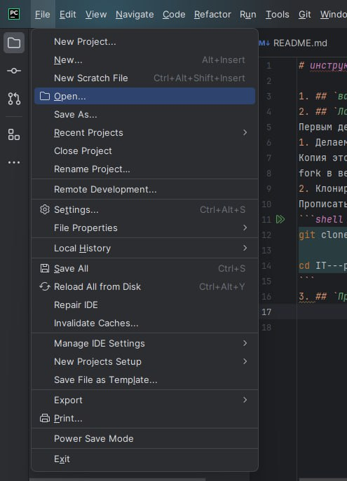
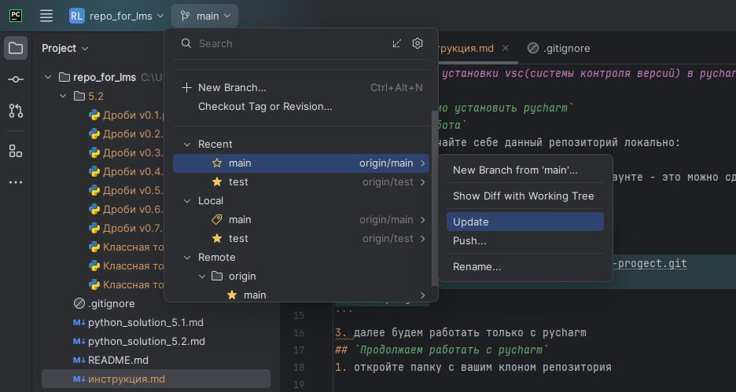
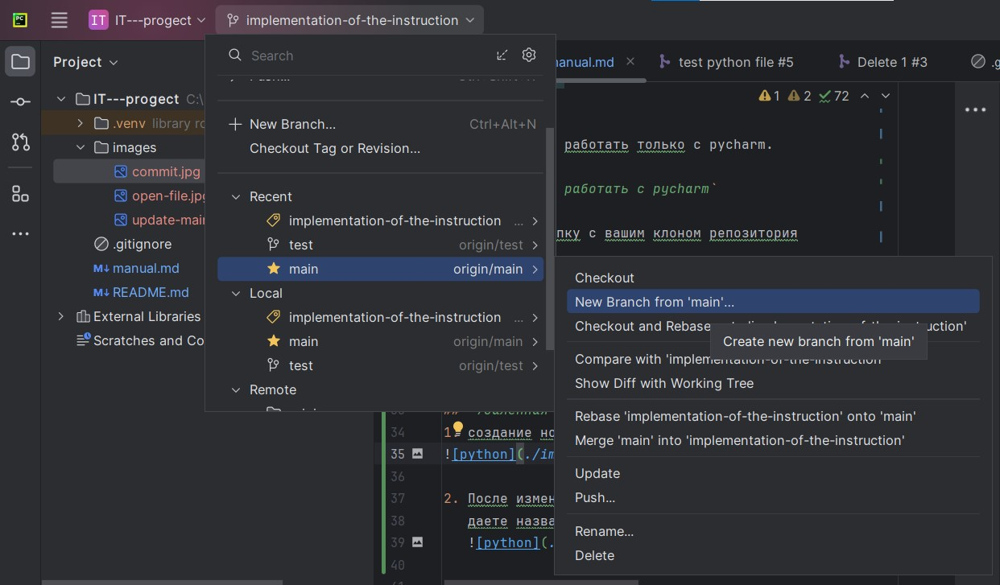
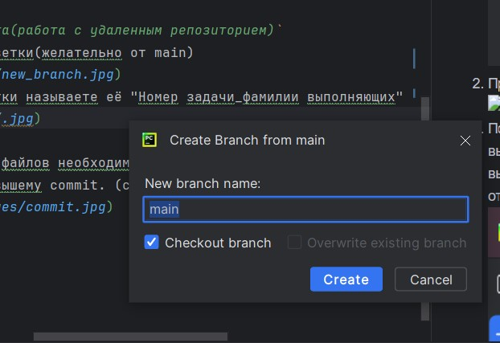
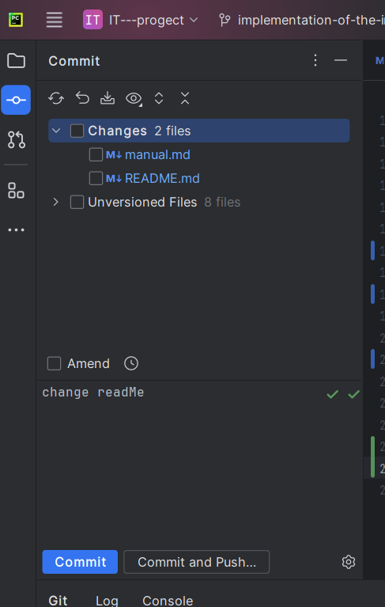
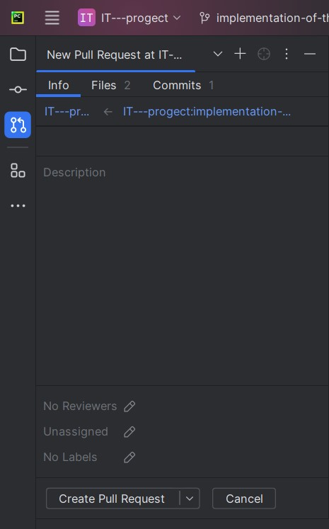

# Инструкция для установки vsc (системы контроля версий) в PyCharm

## `Вам необходимо установить PyCharm`

## `Локальная работа`

Первым делом скачайте себе данный репозиторий локально:

1. Клонируем оригинальный репозиторий, уже созданный, с помощью команд ниже:

```shell
git clone https://github.com/ElizabetDA/IT---progect.git

cd IT---progect
```

2. Далее будем работать только с pycharm.

## `Продолжаем работать с pycharm`

1. Откройте папку с вашим клоном репозитория



2. Необходимо подтягивать все последние изменения



## `Удаленная работа(работа с удаленным репозиторием)`

1. Создайте новую ветку (желательно от main)
   
2. При создании ветки назовите её следующим образом: "Номер задачи_фамилии выполняющих" (галочка отвечает за то, что вы
   переключаетесь на
   нее при создании ветки или позже вручную)

   
3. После изменения файлов, необходимо выполннить commit. В нем вы выбираете файлы, которые необходимо закомитить, а
   также
   даете название вышему commit. (commit - просто закомитить, commit and push - закомитить и отправить на свою ветку)
   
4. Создайте PR(PullRequests)

   
5. Вводите название PR и его описание

   

## Ваша работа считается выполненной, если тимлид замёржил ваш PR. Если оставил rewiew с указаниеам на то, что нужно изменить, то необходимо исправить!